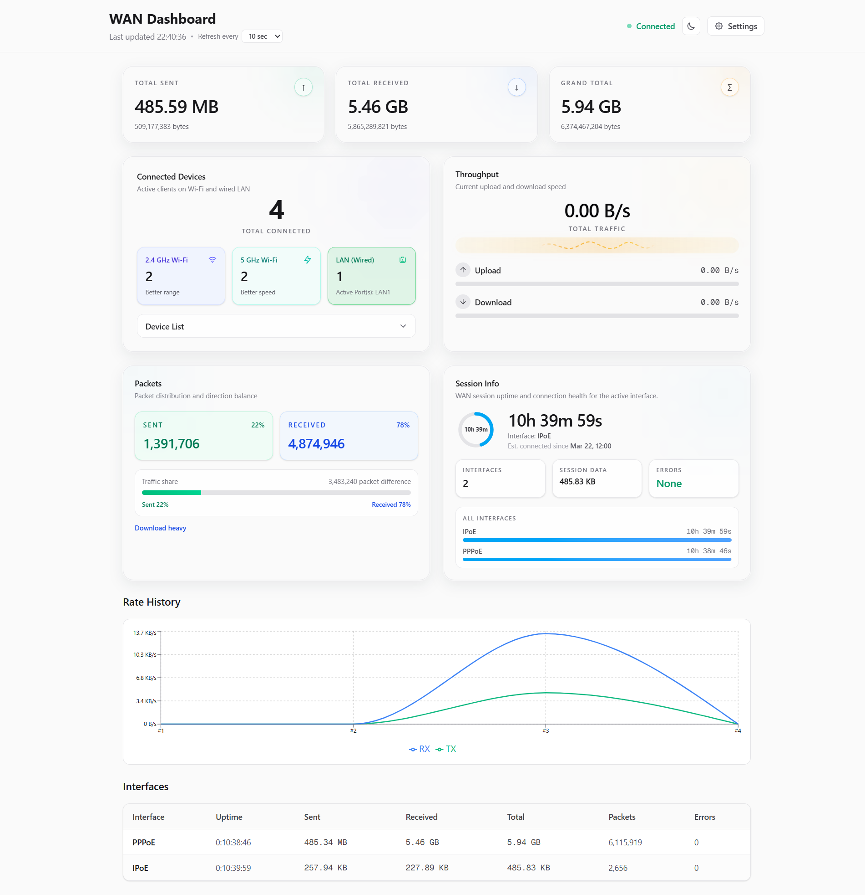
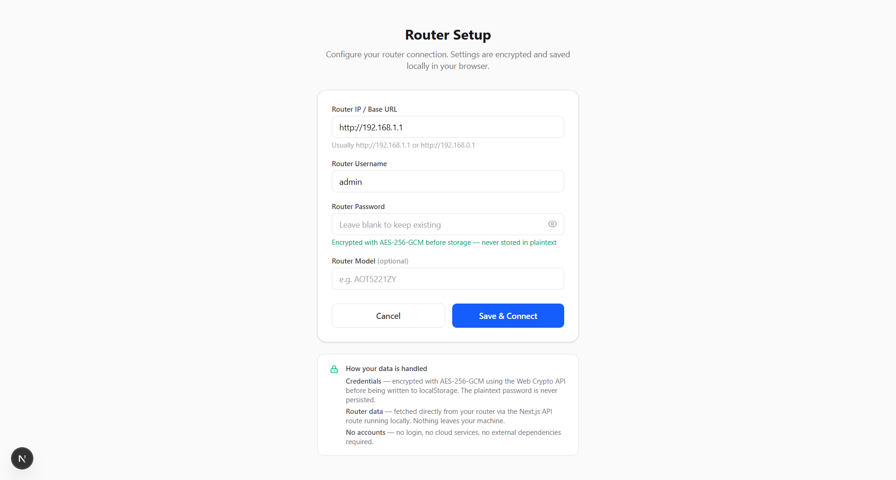

# RouterPulse

A real-time WAN traffic monitor that connects directly to your home router and displays live usage stats — no cloud, no login, no external services.

## Screenshots

### Dashboard



### Setup



## Features

- **Live throughput card** — animated upload/download rates with a combined total traffic readout
- **Rate history chart** — in-session line chart of upload/download speeds over time (up to 30 data points)
- **Connected devices card** — 2.4 GHz / 5 GHz device counts, signal-quality badges, and expandable client list
- **Guest network monitoring** — real-time client counts on guest Wi-Fi networks (per band) with distinct visual styling
- **Active LAN ports** — wired device connection status and active port counts
- **Per-interface stats** — bytes, packets, errors, and uptime for each WAN interface
- **Packet summary** — sent/received packet counts with traffic share breakdown and direction balance
- **Session info** — router uptime ring, active interface, connection health, and error counts
- **Encrypted local config** — credentials stored with AES-256-GCM in `localStorage`
- **Configurable poll interval** — 10s, 15s, 30s, 1 min, or 5 min (persisted across sessions)
- **Dark / light theme** — toggle with system preference support and flash-free hydration
- **Graceful offline handling** — shows last known data with a dismissible offline banner when the router is unreachable
- **Error classification** — distinguishes unreachable, auth, and config errors with actionable fix suggestions
- **Log out / reset** — clears all saved credentials and config from `localStorage` in one click
- **Missing credentials banner** — setup page detects when neither `localStorage` nor `.env.local` has credentials and prompts the user

## Quick start

### Option 1: Configure via `.env.local` (recommended for always-on use)

1. Clone the repo and install dependencies:

```bash
git clone <repo-url>
cd router-pulse
npm install
```

2. Create a `.env.local` file in the project root:

```env
ROUTER_BASE_URL=http://192.168.1.1
ROUTER_USERNAME=admin
ROUTER_PASSWORD=your_router_password
ROUTER_MODEL=AOT5221ZY
```

3. Start the dev server:

```bash
npm run dev
```

4. Open [http://localhost:3000](http://localhost:3000) — the dashboard loads immediately.

### Option 2: Configure via the Setup page (no env file needed)

1. Install and run:

```bash
npm install
npm run dev
```

2. Open [http://localhost:3000](http://localhost:3000) — you will be redirected to the Setup page.

3. Enter your router IP, username, and password. Click **Save & Connect**.

4. Credentials are encrypted and saved in `localStorage`; the dashboard loads automatically.

## Scripts

| Script | Description |
|---|---|
| `npm run dev` | Start the development server |
| `npm run build` | Create a production build |
| `npm start` | Run the production server |
| `npm run lint` | Run ESLint |

## Environment variables

| Variable | Description | Example |
|---|---|---|
| `ROUTER_BASE_URL` | Router admin base URL | `http://192.168.1.1` |
| `ROUTER_USERNAME` | Router admin username | `admin` |
| `ROUTER_PASSWORD` | Router admin password | `your_password` |
| `ROUTER_MODEL` | Router model identifier | `AOT5221ZY` |

If env vars are set, they take precedence over any client-side `localStorage` config.

## Documentation

- **[Technical reference](./docs/TECHNICAL.md)** — project layout, privacy and security, `/api/usage` response shape, router compatibility (CGI endpoints), and tech stack.
